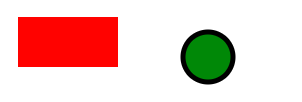
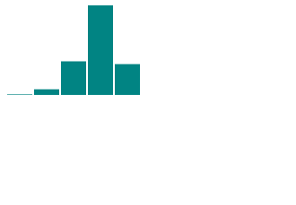

### Charts with SVG and D3

## What is SVG?

Building a chart with Canvas was pretty easy. We did a bit of math and drew some
shapes. But we didn't have animation. We didn’t have interaction. We didn't
handle UI events. And there were lots of hard coded values. What would happen if
we get more data values, or if the values exceed the range we planned for? We
could fix all of these things by hand with more code, or we could use
technologies that handle these things for us: SVG and D3


Just like Canvas, SVG is a box in the web page. The difference is that we can
put shapes directly inline. Here's an SVG box with a rectangle and circle
inside.


```
<html>
<body>
<svg id='chart' width='500' height='100'>
  <rect x='10' y='10' width='100' height='50' fill='blue'/>
  <circle cx='200' cy='50' r='25' fill='green'/>
</svg>
</body>
</html>
```

.screenshot

Now let's style the shapes. We can set attributes directly on the shapes or use
CSS. The CSS works just like regular CSS for the DOM but we use different
properties.


```
<html>
<style type='text/css'>
    svg rect {
        fill: red;
    }
    svg circle {
        stroke: black;
        stroke-width: 5px;
    }
</style>
<body>
<svg id='chart' width='500' height='100'>
  <rect x='10' y='10' width='100' height='50' fill='blue'/>
  <circle cx='200' cy='50' r='25' fill='green'/>
</svg>
</body>
</html>
```

.screenshot


## D3: Data Driven Documents

To draw a chart we could add a bunch of shapes, one for each data point, but
this wouldn't really be an advantage over Canvas. We are still doing a lot of
work by hand.  Instead, we can use an open source library made specifically for
doing data visualization. It is called [D3](http://d3js.org).

D3 was created in 2011 by Mike Bostock, Jeff Heer, and Vadim Ogievetsky at
Standford University as a replacement for their earlier framework, Protovis.


D3 is very powerful while still being accessible. Here are a few examples.

A [colored map](http://bl.ocks.org/mbostock/4060606) of unemployment rates.

A [polar clock](http://bl.ocks.org/mbostock/1096355)

A draggable graph of [mobile patent lawsuits](http://bl.ocks.org/mbostock/1153292)

A chord diagram of [software class relationships](http://bl.ocks.org/mbostock/1046712)


## Simple Chart with D3

Let's start with something simple. We will use D3 to make the same bar chart as
you made in the hands on lab. We will start by creating the SVG element using
the D3 API in Javascript.

```
<script src="http://d3js.org/d3.v3.min.js" charset="utf-8"></script>
<script type='text/javascript'>
var w = 500;   // save our width and height for later
var h = 100;
var dataset = [ 5, 10, 15, 20, 25,];
var svg = d3.select('body')
            .append('svg')
            .attr('w',w)
            .attr('h',h);
```

This is the same as writing the SVG element in the page, but by using D3 we can start
adding behavior. Now let's add a rectangle for each data point.


```
svg.selectAll('rect')
    .data(dataset)
    .enter()
    .append('rect')
    .attr('fill','teal')
    .attr('x',function(d,i) {
        return i*30;
    })
    .attr('y',function(d,i) {
        return h-d*3;
    })
    .attr('width', function(d,i) {
        return 28;
    })
    .attr('height', function(d,i) {
        return d*3;
    })
    ;
```

.screenshot

This is similar to what we did with Canvas, but notice there is no loop. The
library is handling this for us.  Let's go through it step by step.

The `svg.selectAll('rect')` part gets all of the rectangles in the SVG box,
which is currently empty because we don't have any yet. Then it binds to the
data with `data(dataset)`. Next is `enter` which means "whenever a new data
element _enter_s the dataset, do the next stuff". Since all of our data is new
it will call what comes next for every element in our data set.  For each one it
will then create a new rect, `append('rect')`, then set the fill, x, y, width,
and height attributes.

All of the rectangles have the same color so we set the fill with
`attr('fill','teal')`. The other values are different for each element, so
instead of passing a plain value we give it a function. This function will
calculate the correct value based on the data element. For `x` the value is the
index of the element times 30. Each of the other values are similar to what we
did for Canvas, but using these little callback functions instead of the loop
code.

## Scaling Data

What do we do if we get so much data that it won't fit, or if one of the values
is so big it goes off the top of the chart?  As with Canvas, we could calculate
correct values by hand, but D3 already has a way to do this for us. It's called a
_Scale_.

A scale is just a mapping from a set of input values to a set of output values.
Suppose we have the values in our bar chart `[ 5, 50, 300, 800, 275]`. The biggest value
is 800 but our chart only goes up to 100 pixels. We need a scale to map from the
data values to pixel values.  In math the input is called the _domain_ and the
output is called the _range_.  Let's create a new linear scale and set the domain
and range.

```
var yscale = d3.scale.linear()
                    .domain([0, 1000])
                    .range([0, 100]);
```

Now we can call `yscale()` as a function to have it convert numbers for us. We need
to update the y and height setters to use `yscale()` too.

```
svg.selectAll('rect')
...
    .attr('y',function(d,i) {
        return h-yscale(d);
    })
    .attr('height', function(d,i) {
        return yscale(d);
    })
    ;
```


Now any value between 0 and 1000 will work. But what happens if we get a value bigger than
1000?  We've just moved the problem. The real solution is to set the domain to
the maximum value in our actual dataset. Then the chart will always adapt properly.

```
var yscale = d3.scale.linear()
        .domain([0, d3.max(dataset, function(d) { return d; })])
        .range([0, 100]);
```

Here's what it looks like with proper y scaling.

.screenshot


There are other kinds of scales besides linear. Log is very useful when
tracking exponential trends like Moore's law.

.screenshot


## Updating Data

The real magic of D3 is how it handles updates. Everything we've done so
far has been static. It could have been done a hundred years ago in a newspaper,
just with more effort.  To take advantage of the web we can make things
update dynamically with animation.


```
<button id='update'>update</button>

...

d3.select('button').on('click', function() {
    //update the data
    dataset = [ 400, 800, 100, 600, 500, 1000];
    yscale.domain([0, d3.max(dataset, function(d) { return d; })])

    //adjust the y values
    svg.selectAll('rect')
        .data(dataset)
        .attr('y',function(d,i) {
            return h-yscale(d);
        })
        .attr('height', function(d,i) {
            return yscale(d);
        });
});
```

I've added a button at the top of the page and an event handler for it. When the
button is pressed it changes the dataset to the new values and updates the
domain of the `yscale`.  The actual rectangles haven't changed yet, however. To
do that we need to set the data again and update the y and height values. We
could update the x and width values too, but since those aren't changing it
wouldn't make any difference.  

Here's what it looks like.

{{
    type: "interactive"
    href: "d3tutorial/demo2.html"
    image: "lecture2_04a.png"
    text: "Without Animation"
}}


Hmm. That doesn't look too good. The data changes but the bars just suddenly
switch to their new values. There's no sense of how they are changing. We want
to animate the bars to their new heights. D3 can do that for us very easily
with transitions. By adding this code we can create a transition of 500
milliseconds.  The delay function adds a delay to the transition of each
rectangle. This calculates a different delay for each one so the bars
come in one after another over a second, creating a fun animated effect.

```
        .transition().duration(500)
        .delay(function(d,i) {
            return i/dataset.length * 1000; //using msec
        })
```


{{
    type: "interactive"
    href: "d3tutorial/demo3.html"
    image: "lecture2_04b.png"
    text: "Wit Animation"
}}


There's one more thing we need: a Y axis. We can see which bar is biggest but we
don't know how much each bar represents. We need an axis with ticks along the
left edge.  D3 provides an axis class to do this.


```
var yaxis = d3.svg.axis()
          .scale(yscale)
          .orient('right')
          .ticks(5)
          ;

svg.append('g')
      .attr('class','y axis') //add the axis class
      .call(yaxis);
```


{{
    type: "interactive"
    href: "d3tutorial/demo4.html"
    image: "lecture2_05.png"
    text: "Animated bar chart"
}}


Hmm. That's not quite right. The axis is squished near the top
and the bottom. Also, the numbers are going in the wrong direction.
We can fix both problems easily.First modify the yscale.range from `[0,100]` to `[h-10,10]`.
This changes the direction and adds a ten pixel gap on each end.

```
var yscale = d3.scale.linear()
        .domain([0, d3.max(dataset, function(d) { return d; })])
//        .range([0, 100])
        .range([h-10, 10])
        ;
```

Then we have to swap the direction of the y and height attribute setters
```
        .attr('y',function(d,i) {
            //return h-yscale(d);
            return yscale(d);
        })
        .attr('height', function(d,i) {
            //return yscale(d);
            return h-yscale(d);
        });
```

And also update the y-axis when the button is pressed

```
svg.select('.y.axis')
    .transition()
    .duration(1000)
    .call(yaxis);
```

Okay. Now everything is going in the right direction and we have some space
at the bottom. One more thing. Let's restyle the axis to make it look a bit better.
Since this styling won't change we can do it with plain CSS.

```
<style>
.axis path, .axis line{
     fill: none;
     stroke: black;
     shape-rendering: crispEdges;
}
.axis text {
    font-family: sans-serif;
    font-size: 11px;
}
</style>
```


There we go. Much better.

{{
    type: "interactive"
    href: "d3tutorial/demo5.html"
    image: "lecture2_06.png"
    text: "Styled and Animated Bar Chart"
}}


D3 is a very powerful SVG framework. It can do animation, handle user events, style
SVG shapes, and properly scale values to make your charts look great.  D3 can also
create interactive geographical maps. In the hands on you will create a map of the US
showing agricultural data with shades of green.
